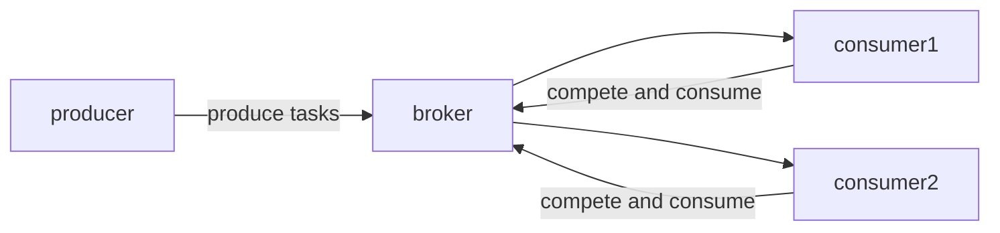

# Golang 分布式异步任务队列

[machinary分析](http://masnun.rocks/2016/11/01/distributed-task-processing-in-golang/)

## 异步任务
> 将需要长时间执行的代码放到一个单独的程序中，例如调用第三方邮件接口，但是这个接口可能非常慢才响应，这时候应当采用异步任务来进行解耦。

    异步任务组成部分
    - broker：用来传递消息，暂时保存产生的任务以便于消费
    - producer：产生任务
    - consumer: 消费任务
    - result backend：保存结果




## 消息
Machinary对消息的定义
```go
// Signature represents a single task invocation
type Signature struct {
    UUID           string
    Name           string
    RoutingKey     string
    ETA            *time.Time
    GroupUUID      string
    GroupTaskCount int
    Args           []Arg
    Headers        Headers
    Immutable      bool
    RetryCount     int
    RetryTimeout   int
    OnSuccess      []*Signature
    OnError        []*Signature
    ChordCallback  *Signature
}

// Producer defines task
signature := tasks.NewSignature

// Register task
machineryServer.RegisterTasks(map[string]interface{}{
  "add":      Add,
})

// Send task
machineryServer.SendTask()

// Generate consumer
worker := machineryServer.NewWorker("send_sms", 10)

// Listenning to broker and consume
worker.Launch()
```

