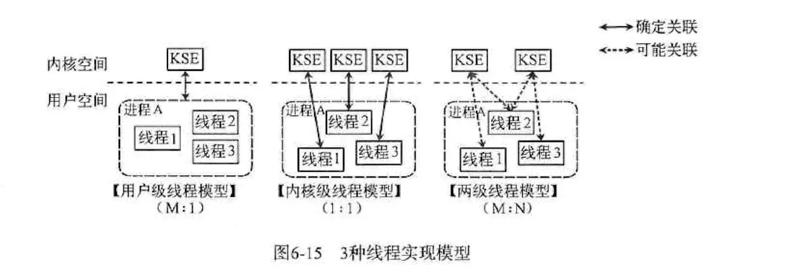
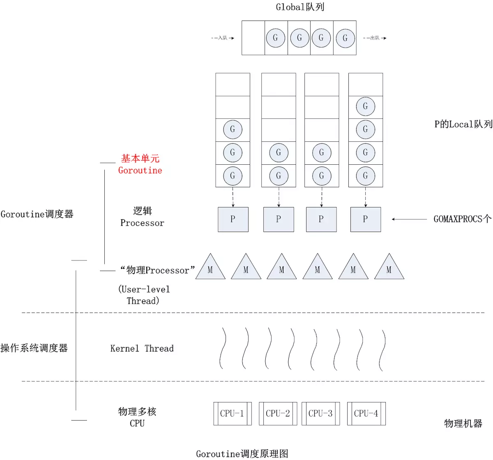
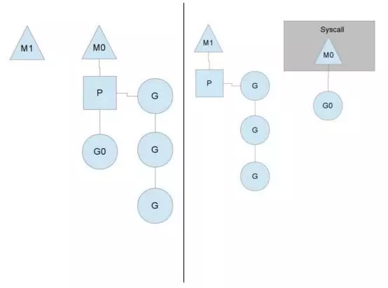

# Golang Concurrency Model

[Golang Concurrency Model](https://www.jianshu.com/p/790384768317)

## 线程模型

根据用户态线程与内核调度实体(Kernel Scheduling Entity)之间的对应关系，分为以下模型

- 内核级线程模型
- 用户及线程模型
- 混合型线程模型

内核调度实体就是指可以被操作系统内核调度器调度的对象实体，即内核级线程，是操作系统中最小的调度资源

### 内核级线程模型

用户线程与内核线程是一对一的关系(1:1)。

大部分编程语言(如linux pthread，java的java.lang.Thread，C++的std::thread等)都是对操作系统的线程(内核级线程)的一层封装，创建出来的每个线程与一个不同的KSE静态关联，因此其调度完全由OS调度器来做。

这种方式实现简单，直接借助OS提供的线程能力，并且不同用户线程之间一般也不会相互影响。但其创建，销毁以及多个线程之间的上下文切换等操作都是直接由OS层亲自来做，在需要使用大量线程的场景下对OS的性能影响会很大

### 用户级线程模型

用户级线程与KSE是多对一的关系(M:1)。

这种线程的创建，销毁以及多个线程之间的协调等操作都是由用户自己实现的线程库来负责，对OS内核透明。一个进程中所有创建的线程都与同一个KSE在运行时动态关联。现在有许多语言实现的 **协程** 基本上都属于这种方式。这种实现方式相比内核级线程可以做的很轻量级，对系统资源的消耗会小很多，因此可以创建的数量与上下文切换所花费的代价也会小得多。

但该模型有个致命的缺点，如果我们在某个用户线程上调用阻塞式系统调用(如阻塞式方式read网络IO)，那么一旦KSE因阻塞被内核调度出CPU的话，剩下的所有对应的用户线程全都会变成阻塞状态(进程挂起)。

所以这些语言的**协程库**会把自己一些阻塞的操作重新封装成非阻塞形式，然后在以前要阻塞的点上，主动让出自己，并通过某种方式通知或唤醒其他待执行的用户线程在该KSE上运行，从而避免了内核调度器由于KSE阻塞而做上下文切换，这样整个进程也不会被阻塞了。

### 混合型线程模型

用户线程与KSE是多对多关系(M:N)

这种实现综合了前两种模型的优点，为一个进程中创建多个KSE，并且线程可以与不同的KSE在运行时进行动态关联，当某个KSE由于其上工作的线程的阻塞操作被内核调度出CPU时，当前与其关联的其余用户线程可以重新与其他KSE建立关联关系。

这种动态关联机制的实现很复杂。Go语言中的并发就是使用的这种实现方式，Go为了实现该模型自己实现了一个运行时调度器来负责Go中的"线程"与KSE的动态关联。

此模型有时也被称为**两级线程模型，即用户调度器实现用户线程到KSE的"调度"，内核调度器实现KSE到CPU的调度**

## Go并发调度：G-P-M模型

### G-P-M模型

G、P和M都是Go语言运行时系统抽象出来概念和数据结构对象：

G: Goroutine的简称，上面用go关键字加函数调用的代码就是创建了一个G对象，是对一个要并发执行的任务的封装，也可以称作用户态线程。属于用户级资源，对OS透明，具备轻量级，可以大量创建，上下文切换成本低等特点。

M: Machine的简称，在linux平台上是用clone系统调用创建的，其与用linux pthread库创建出来的线程本质是一样的，都是利用系统调用创建出来的OS线程实体。M的作用就是执行G中包装的并发任务。**Go运行时系统中的调度器的主要职责就是将G公平合理的安排到多个M上去执行**。其属于OS资源，可创建的数量上也受限于OS，通常情况下G的数量多于活跃的M。

P: Processor的简称，逻辑处理器，主要作用是管理G对象(每个P都有一个G队列)，并为G在M上的运行提供本地化资源。

在1.1之前，Go中的调度器直接将G分配给合适的M运行，但带来了很多问题，例如，不同的G在M上的并发运行需要申请系统资源，而资源的竞争造成了很多系统性能的损耗，因此在Go Runtime中加入了P，让P来管理G对象，G必须要与P绑定，才能运行该P管理的G。这样我们可以在P对象中预先申请一些系统资源(本地资源)，G需要的时候先向自己的本地P申请(无需锁保护)，如果不够用或没有再向全局申请，而且从全局拿的时候回多拿一部分，以供后面高效地使用。

由于P解耦了G和M对象，这样即使由于被其上正在运行的G阻塞住，其余与该M关联的G也可以随着P一起迁移到别的活跃的M上继续运行，从而让G总能及时找到M并运行自己，从而提高系统的并发能力。

Go Runtime系统通过构造G-P-M对象模型实现了一套用户态的并发调度系统，可以自己管理和调度自己的并发任务，所以可以说**Go语言原生支持并发。自己实现的调度器负责将并发任务分配到不同的内核线程上运行，然后内核调度器在CPU上的执行和调度**。

### 调度过程

#### 任务队列

- 创建的goroutine会暂时被放在同一个队列(全局队列)
- 如果这时有空闲的P(系统P的数量默认等于系统cpu核心数)，Go Runtime始终能保证至少一个(通常只有一个)活跃的M(**称为自旋的M**)与空闲P绑定去各种G队列寻找可运行的G任务, 顺序为
    - P自己绑定的队列
    - 全局队列
    - 其他P的绑定队列
- 本地队列未找到，则去全局队列找。全局队列需要锁保护，如果里面有很多任务，会转移一批到本地P队列中，避免每次都去竞争锁。
- 如果全局队列未找到，就从其他P的绑定队列偷任务

#### M执行阻塞操作

这时M将会被内核调度器调度出CPU并处于阻塞状态，与该M关联的其他G同样会被阻塞，但Go Runtime系统的一个监控线程(sysmon线程)能探测到这样的M，并把与该M关联的P剥离，寻找其他空闲或新建的M接管P，然后继续运行其中的G

当阻塞的M恢复，需要找到一个空闲的P来继续执行，如果没有空闲的P，则把原来的G放入全局队列，等待重新调度。

#### 抢占式调度

Linux的内核调度器主要是基于时间片和优先级做调度的。对于相同优先级的线程，内核调度器会尽量保证每个线程都能获得一定的执行时间。为了防止有些线程”饿死“的情况，内核调度器会发起抢占式调度将长期运行的线程中断并让出CPU资源，让其他线程获得执行机会。

Go Runtime调度器也提供可类似的抢占机制，但并不能保证抢占能成功，因为没有中断的能力，它只能通过向运行时间过长的G中设置抢占flag的方法温柔的让运行的G自己主动让出M的执行权。

Goroutine在运行的过程中可以动态的扩展自己的线程栈，Go抢占式调度的机制就是利用goroutine在扩栈的时机，检查抢占flag，来决定当前是否继续执行。

Runtime的监控线程会计时并设置抢占flag到运行时间过长的G，调度后的G将被放入全局队列，这样该M上关联的其他G就可以执行了。因此，如果要被抢占的G正在执行一个很耗时的操作，且没有任何函数操作(如for循环的计算操作)，即使抢占flag被设置，该G也将继续霸占M直到执行完当前任务

## Goroutine和Channel

### 锁之外的另一种同步机制

- 使用场景类似Java的BlockingQueue，用在需要生产者消费者模型的并发环境中

- 锁同步场景下的一种替代方案。Share the Memory by Communicating，以通信的方式去共享内存。

## 网络IO

- 将标准库中的网络库全部封装成非阻塞形式，防止其阻塞底层的M并导致内核调度切换上下文带来的系统开销

- Runtime引入epoll。当某一个Goroutine在进行网络IO操作时，如果网络IO未就绪，就将该Goroutine封装，放入epoll的等待队列，当前G挂起，与其关联的M可以继续执行其他G；当网络IO就绪后，Go Runtime将等待网络IO就绪的G从epoll就绪队列中取出，再由调度器进行调度。

## Conclusion

### Channel

CSP模型