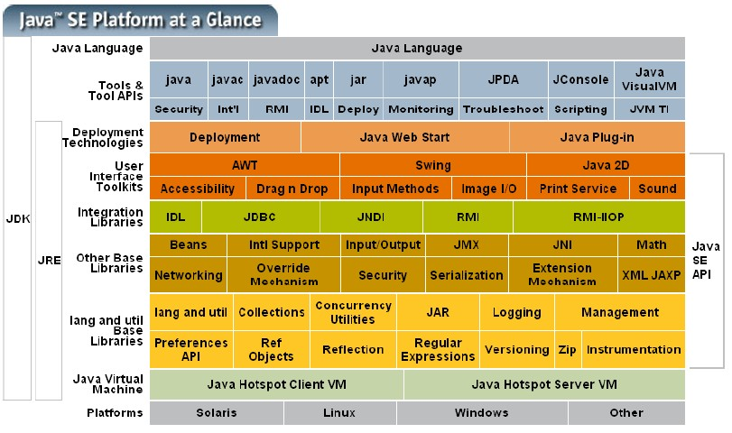
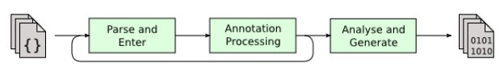
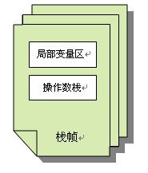
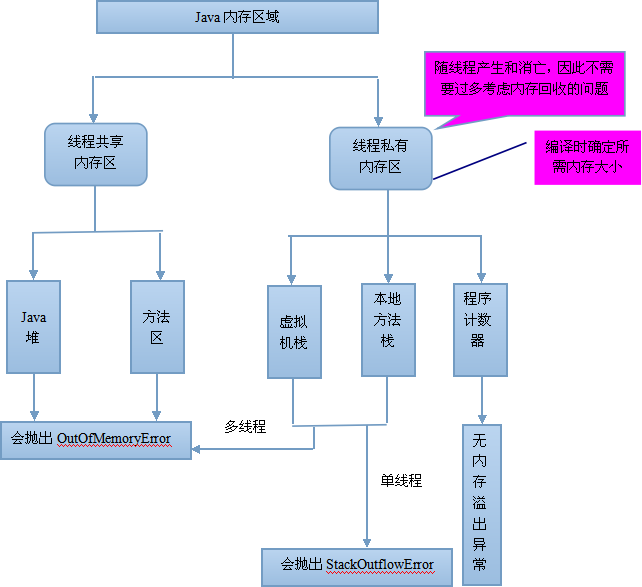

# JVM

[Java vm](https://wiki.jikexueyuan.com/project/java-vm/)

## Java Platform

### 逻辑结构

### 物理结构

## Java 编译和执行

Java代码编译是由Java源码编译器来完成，如图所示

Java字节码的执行是由JVM执行引擎来完成，流程如下

Java 代码编译和执行的整个过程包含了以下三个重要的机制：

- Java 源码编译机制
- 类加载机制
- 类执行机制

### Java 源码编译机制

Java 源码编译由以下三个过程组成：

- 分析和输入到符号表
- 注解处理
- 语义分析和生成字节码

最后组成的class文件由以下部分组成：

- 结构信息
    - 包括class文件格式版本号及各部分的数量与大小的信息
- 元数据
    - 对应于Java源码中声明与常量的信息。包含类/继承的超类/实现的接口的声明信息、域与方法声明信息和常量池
- 方法信息
    - 对应Java源码中语句和表达式对应的信息。包含字节码、异常处理器表、求值栈与局部变量大小、求值栈的类型记录、调试符号信息

### 类加载机制

JVM的类加载是通过 ClassLoader 及其子类来完成的，类的层次关系和加载顺序可以由下图来描述：

- Bootstrap ClassLoader
    - 负责 $JAVA_HOME 中jre/lib/rt.jar里所有的class，由c++实现，不是ClassLoader子类
- Extension ClassLoader
    - 负责加载Java平台扩展功能的一些jar包，包括 $JAVA_HOME中jre/lib/*.jar或-Djava.ext.dirs指定目录下的jar包
- APP ClassLoader
    - 负责记载 classpath 中指定的jar包及目录中class
- Custom ClassLoader
    - 属于应用程序根据自身需要自定义的ClassLoader，如Tomcat、jboss都会根据J2EE规范自行实现ClassLoader。
    
加载过程中会先检查类是否被已加载，检查顺序是自底向上，从Custom ClassLoader 到 Bootstrap ClassLoader逐层检查，只要某个ClassLoader已加载就视为已加载此类，保证此类只所有 ClassLoader 加载一次。而加载的顺序是自顶向下的，也就是由上层来逐层尝试加载此类。

### 类执行机制

JVM是基于栈的体系结构来执行 class字节码的。线程创建后，都会产生程序计数器(PC) 和 栈(Stack)，程序计数器存放下一条要执行的指令在方法内的偏移量，栈中存放一个个栈帧，每个栈帧对应着每个方法的每次调用，而栈帧又是有局部变量区和操作数栈两部分组成，局部变量区用于存放方法中的局部变量和参数，操作数栈中用于存放方法执行过程中产生的中间结果。栈的结构如下图所示：

## Java 内存区域与内存溢出

### 内存区域

Java 虚拟机在执行Java程序的过程中会把他所管理的内存划分为若干个不同的数据区域。Java 虚拟机规范将JVM管理的内存分为以下几个运行时数据区：程序计数器、JAVA虚拟机栈、本地方法栈、Java堆、方法区。下面详细阐述各数据区所存储的数据类型

#### 程序计数器

一块较小的内存空间，它是当前线程所执行的字节码的行号指示器，字节码解释器工作时通过改变该计数器的值来选择下一条需要执行的字节码指令，分支、跳转、循环等基础功能都要依赖它来实现。每条线程都有一个独立的程序计数器，各线程之间的计数器互不影响，因此该区域是线程私有化的。

当线程在执行一个 Java 方法时，该计数器记录的是正在执行的虚拟机字节码的地址，当线程执行的是Native方法(调用本地操作系统方法)时，该计数器的值为空。另外，该内存区域是唯一一个在Java虚拟机规范中没有规定任何OOM情况的区域。

#### Java虚拟机栈

该区域也是线程私有的，它的生命周期也与线程相同。虚拟机栈描述的是Java方法执行的内存模型：每个方法被执行的时候都会同时创建一个栈帧，栈是用于支持虚拟机进行方法调用和方法执行的数据结构。对于执行引擎来说，活动线程中，只有栈顶的栈帧是有效的，称为当前栈帧，这个栈帧所关联的方法称为当前方法，执行引擎所运行的所有字节码指令都只针对当前栈帧进行操作。栈帧用于存储局部变量表、操作数栈、动态链接、方法返回地址和一些额外的附加信息。在编译程序代码时，栈帧中需要多大的局部变量表、多深的操作数栈都已经完全确定了，并且写入了方法表的Code属性之中。因此，一个栈帧需要分配多少内存，不会受到程序运行期变量数据的影响。而仅仅取决于具体的虚拟机实现。

在Java虚拟机规范中，对这个区域规定了两种异常情况：

- 如果线程请求的栈深度大于虚拟机虚拟机所允许的深度，将跑出StackOverflow异常。
- 如果虚拟机在动态扩展栈时无法申请到足够的内存空间，则跑出OutOfMemoryError异常。

这两种情况存在者一些重叠的地方，当栈帧空间无法继续分配时，到底是内存太小，还是已使用的栈空间太大，其本质上只是对同一件事情的两种描述而已。在单线程的操作中，无论是由于栈帧太大，还是虚拟机空间太小，当栈空间无法分配时，虚拟机抛出的都是StackOverflowError异常，而不会得到OutOfMemoryError异常。在多线程环境下，则会抛出OutOfMemoryError异常。

##### 下面详细说明栈帧中所存放的各部分信息的作用和数据结构：

1. 局部变量表

局部变量表是一组变量值存储空间，用于存放方法参数和方法内部定义的局部变量，其中存放数据的类型是编译期可知的各种基本数据类型、对象引用和returnAddress类型(指向一条字节码指令的地址)。局部变量表所需的内存空间在编译期间完成分配，即在Java程序被编译成Class文件时，就确定了所需分配的最大局部变量表的容量。当进入一个方法时，这个方法需要在栈中分配多大的局部变量空间是完全确定的，在方法的运行期间不会改变局部变量表的大小。

局部变量表的容量以变量槽为最小单位。在虚拟机规范中并没有明确指明一个slot应占用的内存空间大小(允许其随着处理器、操作系统或虚拟机的不同而发生变化)。

2. 操作数栈

操作数栈又称为操作栈，操作数栈的最大深度也是在编译的时候确定了。当一个方法开始执行时，它的操作栈是空的，在方法的执行过程中，会有各种字节码指令向操作栈中写入和提取内容，也就是入栈和出栈操作。

Java虚拟机的解释执行引擎称为“基于栈的执行引擎”，其中所指的栈就是操作栈，这点和Android不同，Android虚拟机是基于寄存器的。

3. 动态链接

每个栈帧都包含一个指向运行时常量池(在方法栈中)中该栈帧所属方法的引用，持有这个引用是为了支持方法调用过程中的动态链接。Class文件的常量池中存在有大量的符号引用，字节码中的方法调用指令就以常量池中指向方法的符号引用为参数。这些符号引用，一部分会在类加载阶段或一次使用的时候转化为直接引用，称之为静态链接，另一部分在每一次的运行期间转化为直接引用，这称之为动态链接。

4. 方法返回地址

## 类加载机制

### 类加载过程

## Javac编译与JIT编译